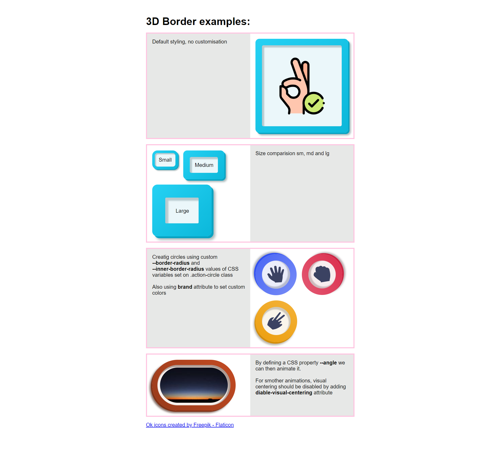

# Reusable Web Components

This is a repository contains web components definitions and demo page with example usages.

## Table of contents

- [3D border component](#3d-border-component)
  - [Description](#description)
  - [Examples](#examples)
<!-- - [My process](#my-process) -->
<!-- - [Author](#author) -->

## 3D Border Component

### Description

This component uses one inner shadow and 2 outer shadows to create a 3D effect on the border.
The color of the border is a gradient from a lighter color to the brand color, to create a effect of light direction.

The component can be customised by adding attributes or by defining CSS variables.

**Available attributes:**

| Name          | Description   | Values  | Default  |
| ------------- | ------------- | ------- | -------- |
| `brand` | main color used  | valid hsl | `hsl(185 70% 45%)`
| `size` | predefined size  | only: `sm`, `md` or `lg` | `md` |
| *`angle` | angle of "light"  | valid css angle |  `45deg` |
| *`diable-visual-centering` | removes padding centering, useful when animating angles  | boolean | `false`


> `angle` - will affect the position of shadows and gradient direction
```css
      ...
      --offset-y: calc(var(--shadow-size) * cos(var(--angle)));
      --offset-x: calc(var(--shadow-size) * sin(var(--angle)));
      ...
      background-image: linear-gradient(
          calc(-1 * var(--angle)),
          var(--border-gradient)
      );
```

> `visual centering` - even if the element is centered, it looks a little bit off, because of inset shadow and the outer shadow (of brand dark color).
To fix this, special padding is defined to counter the shadows effect.
```css
    .visual-centering {
      padding-right: calc(var(--padding) - var(--offset-x) / 2); 
      padding-bottom: calc(var(--padding) - var(--offset-y) / 2); 
    }
```

**CSS Variables:**

| Name          | Description   | Default  |
| ------------- | ------------- | -------- |
| `--shadow-size` | sets base shadow size | `0.35rem` |
| `--border-width` | border width | `1.25rem` |
| `--border-radius` | border radius | `0.75rem` |
| `--inner-border-radius` | inner border radius | `0.3rem` |
| `--padding` | space from border to content | `1rem` |
| `--shadow-strength` | shadow opacity from 0 to 1 | `0.4` |
| `--aspect-ratio` | aspect ratio  | `auto` |
| *`--angle` | angle of "light"  | `45deg` |


> `--angle` variable could be animated by defining an --angle property,
here is an example:
```css
  @property --angle {
    syntax: "<angle>";
    initial-value: 0deg;
    inherits: false;
  }
```

### Examples

[Examples on Github Pages]()




